# chelun [车轮](https://github.com/dm0104x/chelun)

> ​chelun 是仿 车轮 UI 设计的 H5 webApp。项目是基于 Vue+Vuex+Axios+Vue-router。
> ​chelun 采用饿了吗 element-ui 的 UI 组件。

## chelun Screenshots

|         首页         |        图片懒加载         |         楼层效果         |         汽车列表         |
| :------------------: | :-------------------: | :----------------------: | :----------------------: |
| 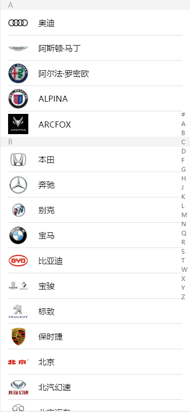 | 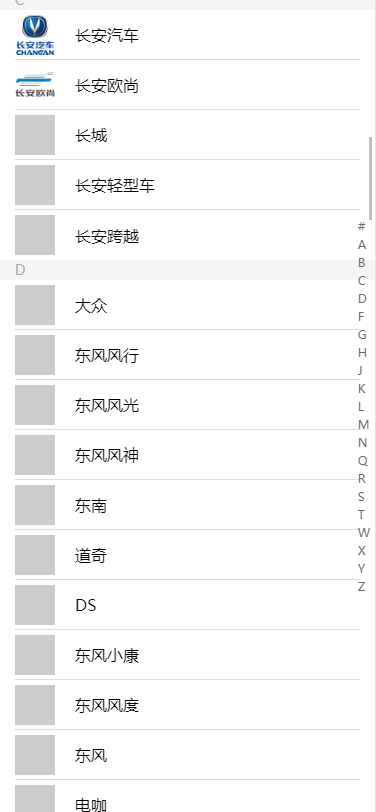 | 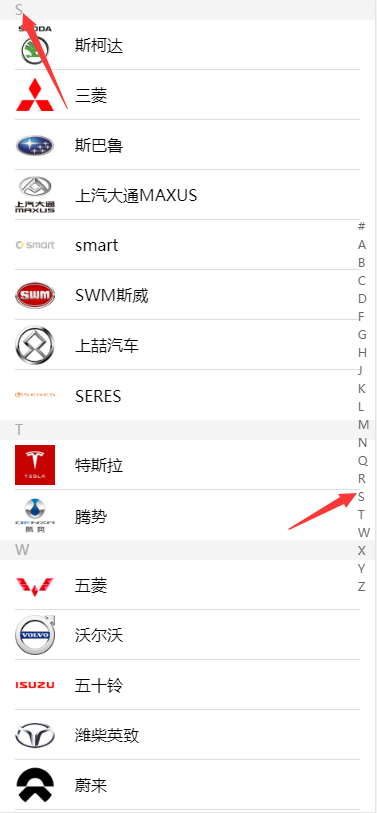 | 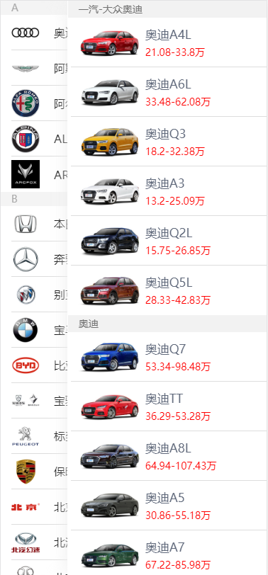 |

|         汽车列表2          |          汽车详情           |            地区查询            |          地址选择           |
| :-------------------: | :-------------------------: | :----------------------------: | :-------------------------: |
| 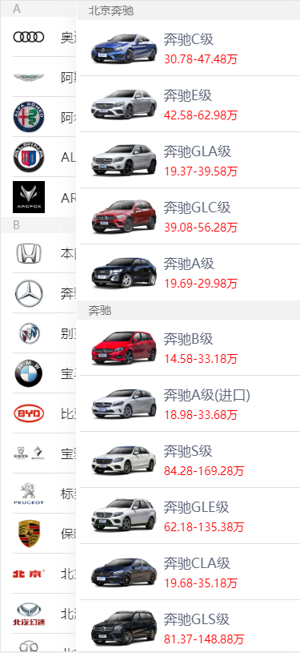 |  | 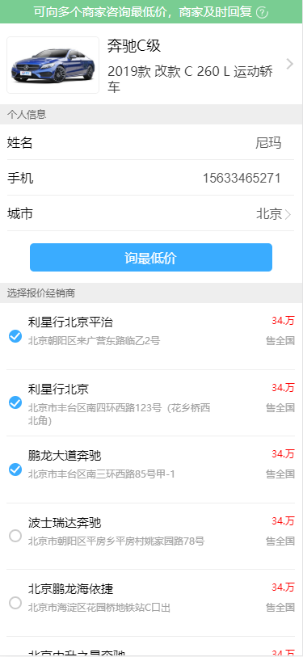 | 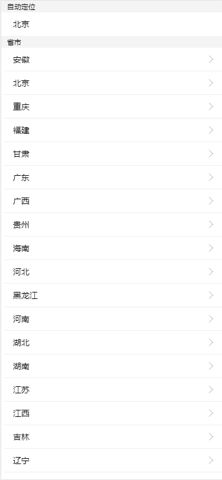 |

|        二级地址        |          颜色类型           |        选择颜色         |         类型         |
| :------------------: | :-------------------------: | :---------------------: | :------------------: |
| 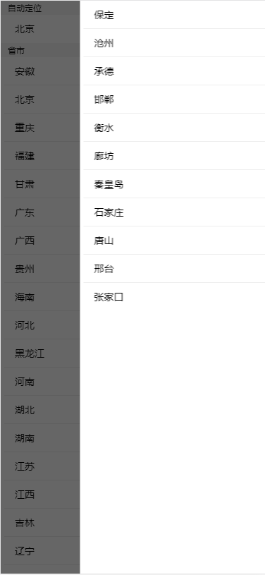 | 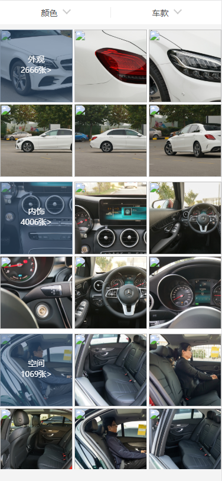 | 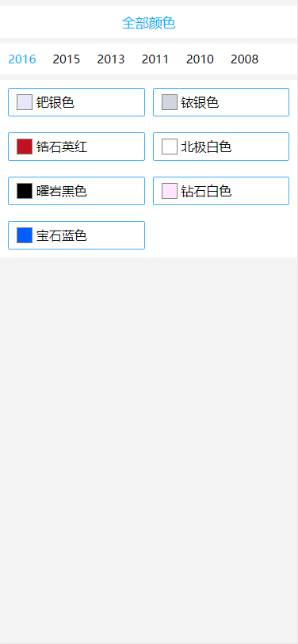 | 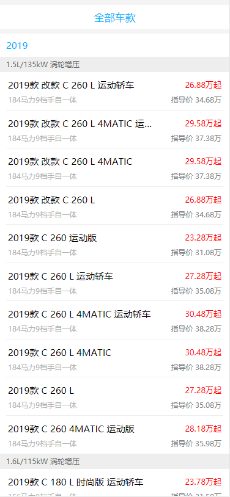 |

## chelun Tips

> - chelun 正在更新维护状态，部分功能尚未没完成。
> - 倘若您发现 Bug 或者有优化意见及其他宝贵意见，欢迎您提交 issue 或者联系我 qq = 2480790748 、Email = 2480790748@qq.com
> - chelun 服务端 ，请移步至 [EasyMarketSever](https://github.com/dm0104x/chelun)。

## chelun 本地部署

> 1. git clone https://github.com/dm0104x/chelun.git
> 2. 安装依赖 cnpm install
> 3. 修改 package.json 文件中 proxy 字段的值 = 你本地服务器的 ip 地址 （"proxy": "http://127.0.0.1:8888"）
> 4. 如果老铁不会在本地部署服务端，可以将第三步的 ip 地址，改成我部署的服务 ip 地址（"proxy": "http://202.96.155.121:8888"）,我部署的服务比较低级，避免挂掉，各位老铁，还是在你本地部署个吧~
> 5. npm run serve / yran serve
> 6. 部署到服务端 npm run build

## chelun 未完成功能

> - 支付订单、订单查询、优惠券...未来会不断完善！

## End

> - 喜欢 chelun，帮忙点个 Star 吧!
> - 作者还会不断更新， 您的支持是作者不断更新的动力!
> - Thanks!

## About Me

> Name: dm0104x
>
> QQ: 2480790748
>
> Email：2480790748@qq.com
